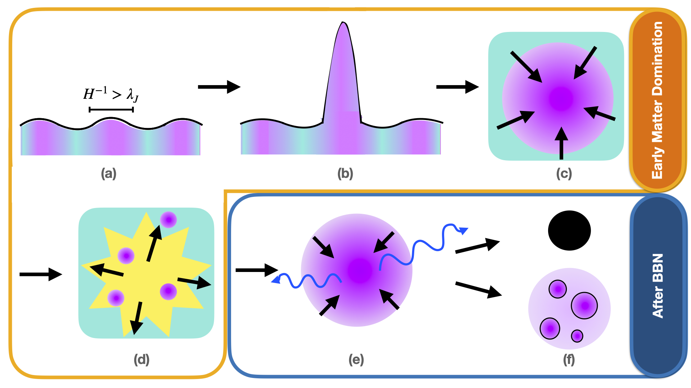

---

##### Download

+ [Published link](https://doi.org/10.1103/PhysRevD.110.043041)
+ [arXiv link](https://arxiv.org/abs/2405.04575)

---

##### Abstract

We demonstrate a novel mechanism for producing dark compact objects and black holes through a dark sector, where all the dark matter can be dissipative. Heavy dark sector particles with masses above $10^4$  GeV can come to dominate the Universe and yield an early matter-dominated era before big bang nucleosynthesis (BBN). Density perturbations in this epoch can grow and collapse into tiny dark matter halos, which cool via self-interactions. The typical halo size is set by the Hubble length once perturbations begin growing, offering a straightforward prediction of the halo size and evolution depending on one’s choice of dark matter model. Once these primordial halos have formed, a thermal phase transition can then shift the Universe back into radiation domination and standard cosmology. These halos can continue to collapse after BBN, resulting in the late-time formation of fragmented dark compact objects and sub-solar-mass primordial black holes. We find that these compact objects can constitute a sizable fraction of all of dark matter. The resulting fragments can have masses between $10^{20}$ and $10^{32}$  g, with radii ranging from $10^{-2}$ to $10^5$  m, while the black holes can have masses between $10^8$ and $10^{34}$  g. Furthermore, a unique feature of this model is the late-time formation of black holes which can evaporate today. We compare where these objects lie with respect to current primordial black hole and massive (astrophysical) compact halo object constraints.

---

##### Figure 1: Our Cosmological Scenario



---

##### Citation

J. Bramante, C. V. Cappiello, M. D. Diamond, **J. L. Kim**$^{†}$, Q. Liu and A. C. Vincent,
Dissipative dark cosmology: From early matter dominance to delayed compact objects, Phys. Rev. D 110 (2024) 043041 [2405.04575].

```BibTeX
@article{Bramante:2024pyc,
    author = "Bramante, Joseph and Cappiello, Christopher V. and Diamond, Melissa and Kim, J. Leo and Liu, Qinrui and Vincent, Aaron C.",
    title = "{Dissipative dark cosmology: From early matter dominance to delayed compact objects}",
    eprint = "2405.04575",
    archivePrefix = "arXiv",
    primaryClass = "hep-ph",
    doi = "10.1103/PhysRevD.110.043041",
    journal = "Phys. Rev. D",
    volume = "110",
    number = "4",
    pages = "043041",
    year = "2024"
}
```

---

##### Related material

+ [Presentation slides](presentation1.pdf)
+ [Summary of the paper](https://www.penguinrandomhouse.com/books/110403/unusual-uses-for-olive-oil-by-alexander-mccall-smith/)
